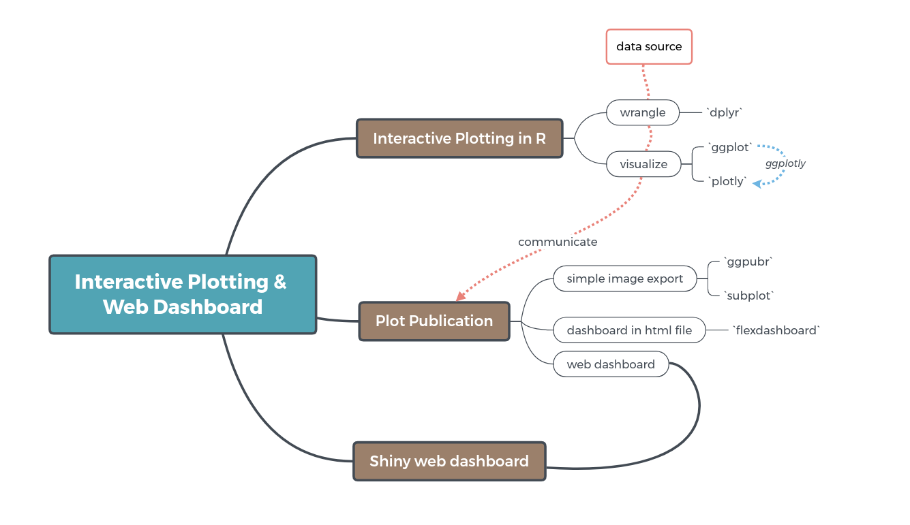

```{r setup, include=FALSE}
knitr::opts_chunk$set(
	echo = TRUE,
	message = FALSE,
	warning = FALSE
)
options(scipen = 99)

library(tidyverse)
library(plotly)
library(ggpubr)
```

# Disclaimer

The original content for Neural Network and Deep Learning course is produced and developed at Algoritma and is used as the main reference for [Algoritma Academy](http://algorit.ma/)

## Training Objectives

The primary objective of this course is to provide a fun and hands-on session to help participants gain full proficiency in data visualization systems and tools. 

- Data transformation using `dplyr` library:
  - `select()`  
  - `filter()`  
  - `mutate()`  
  - `summarise()`  
  - `group_by()` and `ungroup()` 
- Using `ggplotly` to adds interactivity to `ggplot2` object  
- Plot publication  
  - Export plot to pdf with `ggpubr`  
  - Export interactive plot with `subplot()` function from `plotly`
  - Creat HTML dashboard with `flexdashboard`
- Creating web-based dashboard using `shiny` library  

## Concept Map

 

# Interactive Plotting in R

As data grow in complexity and size, often times the designer is tasked with the difficult task of balancing overarching storytelling with specificity in their narrative. The designer is also tasked with striking a fine balance between coverage and details under the all-too-real constraints of static graphs and plots.

Interactive visualization is a mean of overcoming these constraints, and as we’ll see later, quite a successful one at that. Quoting from the author of `superheat` Rebecca Barter, “Interactivity allows the viewer to engage with your data in ways impossible by static graphs. With an interactive plot, viewers can zoom into areas they care about, highlight data points that are relevant to them and hide the information that isn’t.”

We’ll start by reading our data in. The data we'll be using is the [Women in Workforce](https://github.com/rfordatascience/tidytuesday/blob/master/data/2019/2019-03-05/readme.md) data which is a historical data about womens’ earnings and employment status, specific occupation and earnings from 2013-2016, compiled from the [Bureau of Labor Statistics](https://www.bls.gov/) and the [Census Bureau](https://www.census.gov/.

```{r}
workers <- read_csv('data/jobs_gender.csv')
```


## Data Transformation

Data transformation is one of the crucial part in preparing our interactive charts. In the past, we’ve relied on R’s base functionality for data preparation. This time, by using `dplyr`, we'll learn on new techniques that may greatly increase our productivity when working with R. 

This technique is developed as “a grammar of data manipulation”, and works by providing a consistent set of “verbs” that help us solve the most common data manipulation challenges:  

- `select()`: For select-ing columns  

```{r}
select(workers, c(year, major_category, percent_female))
```

```{r}
# using pipe operator
workers %>% 
  select(year, major_category, percent_female)
```

- `filter()`: for filter-ing row  

```{r}
workers %>% 
  select(year, major_category, percent_female) %>% 
  filter(year == 2016)
```

- `mutate()`: For manipulating column; either manipulate existing column, or create new column.  

```{r}
workers %>% 
  select(year, major_category, percent_female) %>% 
  filter(year == 2016) %>% 
  mutate(percent_male = 100-percent_female)
```

- `group_by()`: For setting group to our data
- `summarise()`: For taking a summary from our data
- `ungroup()`: For unsetting group

Without adding `group_by()`, `summarise()` will take a summary from all existing rows in defined numerical column:  

```{r}
workers %>% 
  # select(year, major_category, percent_female) %>% 
  filter(year == 2016) %>% 
  mutate(percent_male = 100-percent_female) %>% 
  summarise(
    percent_female = mean(percent_female),
    percent_male = mean(percent_male)
  )
```

By adding `group_by()`, `summarise()` will give summaries grouped by categorical column:  

```{r}
workers %>% 
  # select(year, major_category, percent_female) %>% 
  filter(year == 2016) %>% 
  mutate(percent_male = 100-percent_female) %>% 
  group_by(major_category) %>% 
  summarise(percent_male = mean(percent_male),
            percent_female = mean(percent_female)) %>% 
  ungroup()
```

**_Extra Notes_: Why you should use `ungroup()` after every `group_by()`**  

`group_by()` adds metadata to a data.frame that marks how rows should be grouped. As long as that metadata is there, all transformation that you do after the grouping will involved all the grouping columns.

See the following example: 

```{r}
# Avoid potential unintended errors due to the grouping.

# the following fails because mutate is trying
# change one of the columns used by group_by
# and it can see that because of the meta-data
# passed through by dplyr::summarize

# workers %>% 
#   group_by(major_category, minor_category) %>% 
#   summarise(percent_male = mean(percent_male),
#             percent_female = mean(percent_female)) %>% 
#   # ungroup() %>% # ungroup removes any grouping meta-data
#   mutate(minor_category = reorder(minor_category, percent_male))
```

- `arrange()`: For arranging our rows based on a column value

```{r}
workers %>% 
  # select(year, major_category, percent_female) %>% 
  filter(year == 2016) %>% 
  mutate(percent_male = 100-percent_female) %>% 
  group_by(major_category) %>% 
  summarise(percent_male = mean(percent_male),
            percent_female = mean(percent_female)) %>% 
  ungroup() %>% 
  arrange(desc(percent_female))
```


### Other useful functions:

- `drop_na()`: For dropping any NA rows in specified column(s)

```{r}
# check NA values
colSums(is.na(workers))
```

```{r}
# drop NA rows with `drop_na()`
workers <- workers %>% 
  drop_na(total_earnings_male, total_earnings_female)

# check NA values
colSums(is.na(workers))
```

- `n()`: For counting number of row, either for all row or by group

```{r}
# return same value as `nrow(workers)`
workers %>% 
  summarise(n_total = n())

```

```{r}
# count number of observations based on grouping category
workers %>% 
  group_by(major_category) %>% 
  summarise(n_total = n()) %>% 
  ungroup()
```


- `pivot_longer()` / `pivot_wider()` for data reshaping

```{r}
# use `pivot_longer` to convert wide to long
df <- workers %>% 
  filter(year == 2016) %>% 
  mutate(percent_male = 100-percent_female) %>% 
  group_by(major_category) %>% 
  summarise(percent_male = mean(percent_male),
            percent_female = mean(percent_female)) %>% 
  ungroup() %>% 
  arrange(desc(percent_female))
  
df %>% 
  pivot_longer(cols = -major_category)
```

```{r}
# example on how to use `pivot_wider`
df_long <- df %>% 
  pivot_longer(cols = -major_category)

df_long %>%
  pivot_wider(names_from = name, values_from = value)
```


### Dive Deeper  
- Est. Time: 20 mins  

Read in `data/youtubetrends.csv` and save it as `vids`, then follow the following instructions:    

1. In `vids` dataframe, create two new columns; `likesperview` which stores the ratio of likes/view and `dislikesperview` which stores the ratio of dislikes/view:

```{r}
## Your code here

```

2. `summarise()` is compatible with almost all the functions in R. By using the `n()` function, count the total number of trending videos (1 row = 1 video) in each channel. Take only the channels that have at least 10 videos being trending and save it as `vids_top`:

```{r}
## Your code here


```

3. Lastly, transform `vids_top` as a long-format dataframe using `pivot_longer()`:

```{r}
## Your code here


```

## Using `ggplot` + `plotly`

To wrap all the process we performed earlier, in the following chunk, we'll start off by re-reading, tidying & transforming the data:

```{r message=FALSE, warning=FALSE}
# read data
workers <- read_csv("data/jobs_gender.csv")

# read theme from RDS
theme_algoritma <- readRDS('assets/theme_algoritma.rds')

# tidy data
workers <- workers %>% 
  mutate(percent_male = 100-percent_female) %>% 
  drop_na(total_earnings_male, total_earnings_female)

```

I've also copy-paste the earlier transformation process and save it as `workers_gap` dataframe. Using this data, we'll visualize the men vs. women workers gender gap in 2016.

```{r}
# transform data
workers_gap <- workers %>% 
  filter(year == 2016) %>% 
  group_by(major_category) %>% 
  summarise(Male = mean(percent_male),
            Female = mean(percent_female)) %>% 
  ungroup() %>% 
  mutate(
    major_category = reorder(major_category,
                             Male-Female)
  ) %>% 
  pivot_longer(cols = -major_category) %>% 
  mutate(
    text = glue::glue('{name}: {round(value,2)}%')
  )
  
```


```{r}
# visualize
plot <- ggplot(workers_gap, aes(x = value, y = major_category, text = text))+
  geom_col(aes(fill = name))+
  geom_vline(xintercept = 50, linetype = "dotted")+
  labs(x=NULL, y = NULL, title = "US Labor Force Participation in 2016")+
  theme(legend.position = "none")+
  scale_x_continuous(labels = scales::unit_format(unit = "%"))+
  theme_algoritma

# add interactivity
ggplotly(plot, tooltip = "text")
```

### Dive Deeper
- Est. 20-25 mins  

Using `ggplot` & `plotly`, recreate the plot in `assets/divedeep2.html` file!

```{r}
## Your code here


```

# Plot Publication

```{r}
# Reference answer for previous dive deeper
workers_earn <- workers %>% 
  filter(year == 2016) %>% 
  group_by(major_category) %>% 
  summarise(Male = mean(total_earnings_male),
            Female = mean(total_earnings_female)) %>% 
  ungroup() %>% 
  mutate(
    major_category = reorder(major_category,
                             Male-Female)
  ) %>% 
  pivot_longer(cols = -major_category) %>% 
  mutate(
    text = glue::glue('{name}: {round(value,2)}$')
  )

# visualize
plot_earn <- ggplot(workers_earn, aes(x = value, y = major_category, text = text))+
  geom_col(aes(fill = name), position = "dodge")+
  labs(x=NULL, y = NULL, title = "US Gender Pay Gap in 2016")+
  theme(legend.position = "none")+
  scale_x_continuous(labels = scales::unit_format(unit = "$"))+
  theme_algoritma

# add interactivity
ggplotly(plot_earn, tooltip = "text")
```

## Arrange & Export

- Using `ggarrange()` and `ggexport()` from `ggpubr` library to export as simple pdf file:

```{r}
# arrange
ggarrange(plot_earn, plot, nrow = 2)

# export 
ggexport(
  ggarrange(plot_earn, plot, nrow = 2),
  filename = "publication.pdf"
)

```

## Flexdashboard

Easy interactive dashboards for R:  
- Use R Markdown to publish a group of related data visualizations as a dashboard.  
- Support for a wide variety of components including htmlwidgets; base, lattice, and grid graphics; tabular data; gauges and value boxes; and text annotations.  

More about `flexdashboard`: 
- https://rmarkdown.rstudio.com/flexdashboard/index.html  
- https://rmarkdown.rstudio.com/flexdashboard/using.html#storyboards  

## Shiny

To keep the notebook light, the `shiny` section will be created under different rmd file. Please open `shiny.Rmd` for the next section.

