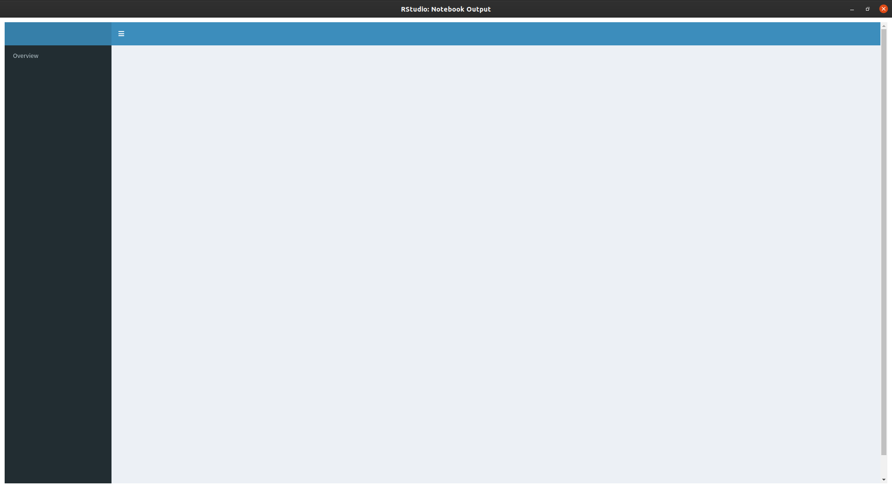
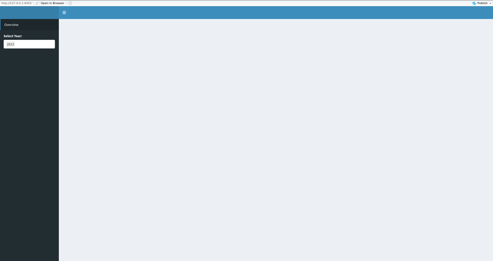
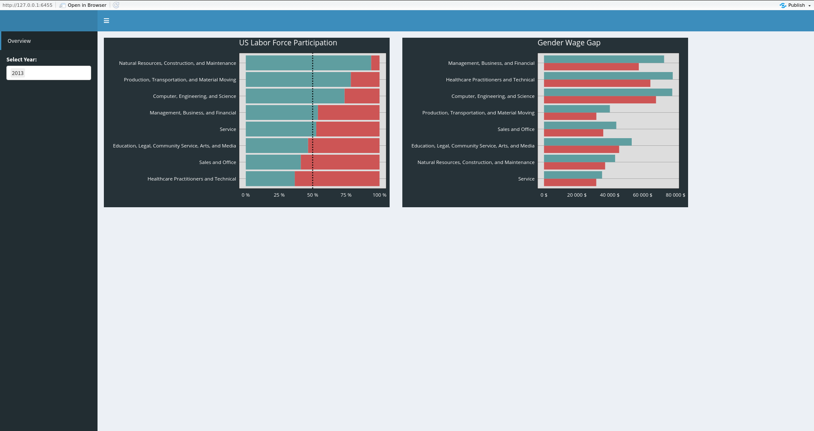
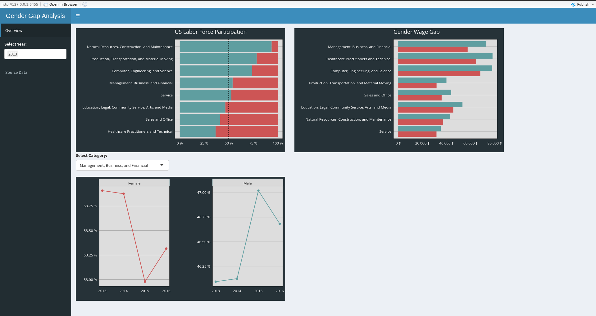
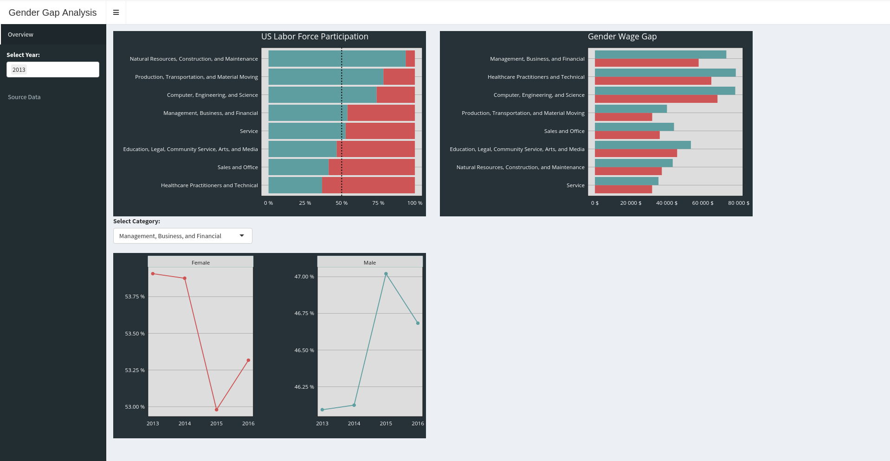
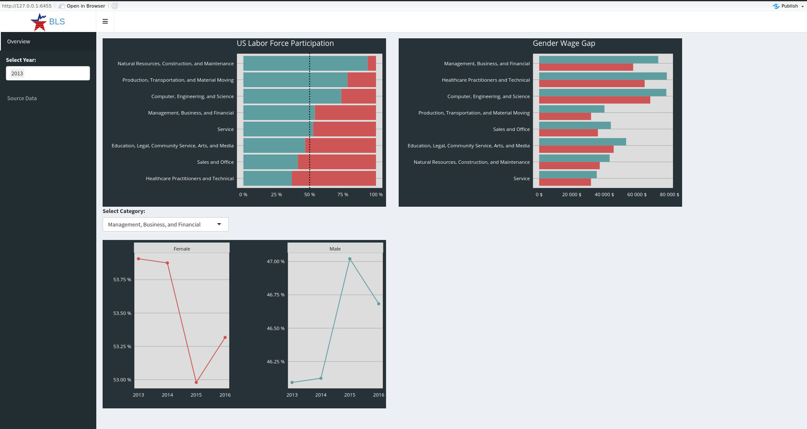
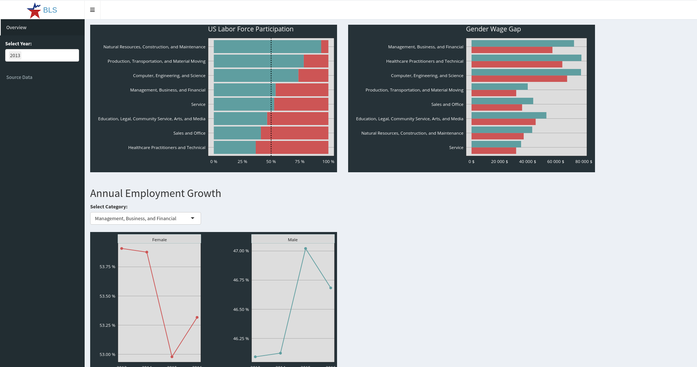

```{r setup, include=FALSE}
knitr::opts_chunk$set(echo = TRUE,
                      eval = FALSE)
```

# Overviews & Main Structure

Shiny is an open package from RStudio, which provides a web application framework to create interactive web applications (visualization) called “Shiny apps”. The ease of working with Shiny has what popularized it among R users. These web applications seamlessly display R objects (like plots, tables etc.) and can also be made live to allow access to anyone.  
  
Shiny provides automatic reactive binding between inputs and outputs. It also provides extensive pre-built widgets which make it possible to build elegant and powerful applications with minimal effort.  
  
**Structure of a basic shiny apps:**  
  
- **global.R**: For setting-up the apps’ environment, e.g., libraries, import and initial cleaning dataset  
- **ui.R**: User Interface (UI) for displaying input and output  
- **server.R**: For processing user’s input and render it into output  
  
One of many useful libraries that we can use is `shinydashboard`. We can use `shinydashboard` to create a dashboard apps for our users.

# Using `shiny` and `shinydashboard`

## Basic `global.R`, `ui.R`, and `server.R` set-up

- global.R:

```{r}
library(shiny)
library(shinydashboard)
```

- ui.R:

```{r}
header <- dashboardHeader()

sidebar <- dashboardSidebar()

body <- dashboardBody()

dashboardPage(
  header = header,
  body = body,
  sidebar = sidebar
)
```

- server.R:

```{r}
function(input, output) {

}
```


## Basic UI Parts

The most common way is to add `sidebarMenu()` on the sidebar side and `tabItems()` on the body side:

- global.R:

```{r}
library(shiny)
library(shinydashboard)
```

- ui.R:

Notice that we've added `sidebarMenu()` on `dashboardSidebar()`, and `tabItems()` on `dashboardBody()`

```{r}
header <- dashboardHeader()

sidebar <- dashboardSidebar(
  sidebarMenu(

  )
)

body <- dashboardBody(
  tabItems(

  )
)

dashboardPage(
  header = header,
  body = body,
  sidebar = sidebar
)
```

- server.R:

```{r}
function(input, output) {

}
```

### Add sidebar Menu and Connect it to the Tab Body

- ui.R:

Notice that we've now also added `menuItem()` on `sidebarMenu()`, and `tabItem()` on `tabItems()`

```{r}
header <- dashboardHeader()

sidebar <- dashboardSidebar(
  sidebarMenu(
    menuItem(
      text = "Overview",
      tabName = "overview"
    )
  )
)

body <- dashboardBody(
  tabItems(
    tabItem(tabName = "overview"

    ) 
  )
)

dashboardPage(
  header = header,
  body = body,
  sidebar = sidebar
)
```




### Layouting your UI

Now that you have defined the body part of the tab you've created, you can start to do some layout-ing to the body of the tab. For the layouting options, you can once again refer to the Cheatsheet that available in the Help tab of your RStudio. 

In this app, we'll use the `fluidRow()` for our body layout:

- ui.R:

Notice that we've now also added a `fluidRow()`, with 2 columns inside:

```{r}
header <- dashboardHeader()

sidebar <- dashboardSidebar(
  sidebarMenu(
    menuItem(
      text = "Overview",
      tabName = "overview"
    )
  )
)

body <- dashboardBody(
  tabItems(
    tabItem(
      tabName = "overview",
      fluidRow(
        column(
          width = 5
        ),
        column(
          width = 5
        )
      )
    ) 
  )
)

dashboardPage(
  header = header,
  body = body,
  sidebar = sidebar
)
```


## Set-up your First Input-Output Flow

A very common input-output flow can be outlined into some parts:  
  
- **input:** use `*Input()` in **ui.R**, e.g. `selectInput()`  
- **render:** use `output$outputName <- render*({ return(output_object) })` in **server.R**  
- **output:** use `*Output("outputName")`in **ui.R**  
  
In the real usage, you can change `*` with some basic grammar we frequently use.  
  
For example:  
  
- input: `selectInput()` for providing select input to users
- render: `output$outputID <- renderPlot({})` for rendering a plot output
- output: `plotOutput("outputID")` for displaying a plot output  

Let’s simulate each part step-by-step to work on our Women Workers' Shiny!  
  
**1. Defining Input**

- global.R  

Call all libraries and read data in global.R. Notice that we also create `yearOpt`, which will be the options that appear on our `selectInput()`:  

```{r}
library(shiny)
library(shinydashboard)
library(tidyverse)
library(DT)
library(plotly)

# read data
workers <- read_csv("data/jobs_gender.csv")

# read theme from RDS
theme_algoritma <- readRDS('assets/theme_algoritma.rds')

# tidy data
workers <- workers %>% 
  mutate(percent_male = 100-percent_female) %>% 
  drop_na(total_earnings_male, total_earnings_female)

# Options for choices
yearOpt <- unique(workers$year)
  
```

- ui.R

Notice that we have now added a `selectInput` in the sidebar:

```{r}
header <- dashboardHeader()

sidebar <- dashboardSidebar(
  sidebarMenu(
    menuItem(
      text = "Overview",
      tabName = "overview"
    ),
    selectInput(
      inputId = "selectYear",
      label = "Select Year:",
      choices = yearOpt, #c(2013,2014,2015,2016)
      selected = yearOpt[1],
      multiple = T
    )
  )
)

body <- dashboardBody(
  tabItems(
    tabItem(
      tabName = "overview",
      fluidRow(
        column(
          width = 5
        ),
        column(
          width = 5
        )
      )
    ) 
  )
)

dashboardPage(
  header = header,
  body = body,
  sidebar = sidebar
)
```

  



**2. Rendering Output**  

- server.R

We're now doing the rendering process on the server side:

```{r}
function(input, output){
  
  # employment plot ---------------------------------------------------------
  output$employPlot <- renderPlotly({
    
        # transform data
        workers_gap <- workersYear() %>% 
            filter(year %in% input$selectYear) %>% 
            group_by(major_category) %>% 
            summarise(Male = mean(percent_male),
                      Female = mean(percent_female)) %>% 
            ungroup() %>% 
            mutate(
                major_category = reorder(major_category,
                                         Male-Female)
            ) %>% 
            pivot_longer(cols = -major_category) %>% 
            mutate(
                text = glue::glue('{name}: {round(value,2)}%'))
        # visualize
        plot <- ggplot(workers_gap, aes(x = value, y = major_category, text = text))+
            geom_col(aes(fill = name))+
            geom_vline(xintercept = 50, linetype = "dotted")+
            labs(x=NULL, y = NULL, title = glue::glue("US Labor Force Participation"))+
            theme(legend.position = "none")+
            scale_x_continuous(labels = scales::unit_format(unit = "%"))+
            scale_fill_manual(values = c("indianred3","cadetblue"))+
            theme_algoritma
        
        # add interactivity
        ggplotly(plot, tooltip = "text") %>% config(displayModeBar = F)
    })
  
  # wage plot ---------------------------------------------------------------

    output$wagePlot <- renderPlotly({
        workers_earn <- workersYear() %>% 
            filter(year %in% input$selectYear) %>% 
            group_by(major_category) %>% 
            summarise(Male = mean(total_earnings_male),
                      Female = mean(total_earnings_female)) %>% 
            ungroup() %>% 
            mutate(
                major_category = reorder(major_category,
                                         Male-Female)
            ) %>% 
            pivot_longer(cols = -major_category) %>% 
            mutate(
                text = glue::glue('{name}: {round(value,2)}$')
            )
        
        # visualize
        plot_earn <- ggplot(workers_earn, aes(x = major_category,
                                              y = value, text = text))+
            coord_flip()+
            geom_col(aes(fill = name), position = "dodge")+
            labs(x=NULL, y = NULL, title = "Gender Wage Gap")+
            theme(legend.position = "none")+
            scale_y_continuous(labels = scales::unit_format(unit = "$"))+
            scale_fill_manual(values = c("indianred3","cadetblue"))+
            theme_algoritma
        
        # add interactivity
        ggplotly(plot_earn, tooltip = "text") %>% config(displayModeBar = F)
        
    })
}
```

**3. Displaying Output**

If you try to run the app right after adding the code above, you will still see no plot shown in the tab body. That's because you haven't define the output on the UI side. So, let's also add it into our `ui.R`:

- global.R

```{r}
library(shiny)
library(shinydashboard)
library(tidyverse)
library(DT)
library(plotly)

# read data
workers <- read_csv("data/jobs_gender.csv")

# read theme from RDS
theme_algoritma <- readRDS('assets/theme_algoritma.rds')

# tidy data
workers <- workers %>% 
  mutate(percent_male = 100-percent_female) %>% 
  drop_na(total_earnings_male, total_earnings_female)

# Options for choices
yearOpt <- unique(workers$year)
```

- ui.R : add `plotlyOutput()` in each column of the `fluidRow()`:

```{r}
header <- dashboardHeader()

sidebar <- dashboardSidebar(
  sidebarMenu(
    menuItem(
      text = "Overview",
      tabName = "overview"
    ),
    selectInput(
      inputId = "selectYear",
      label = "Select Year:",
      choices = yearOpt, #c(2013,2014,2015,2016)
      selected = yearOpt[1],
      multiple = T
    )
  )
)

body <- dashboardBody(
  tabItems(
    tabItem(
      tabName = "overview",
      fluidRow(
        column(
          width = 5,
          plotlyOutput("employPlot")
        ),
        column(
          width = 5,
          plotlyOutput("wagePlot")
        )
      )
    ) 
  )
)

dashboardPage(
  header = header,
  body = body,
  sidebar = sidebar
)
```

- server.R

```{r}
function(input, output){
  
  # employment plot ---------------------------------------------------------
  output$employPlot <- renderPlotly({
    
        # transform data
        workers_gap <- workers %>% 
            filter(year %in% input$selectYear) %>% 
            group_by(major_category) %>% 
            summarise(Male = mean(percent_male),
                      Female = mean(percent_female)) %>% 
            ungroup() %>% 
            mutate(
                major_category = reorder(major_category,
                                         Male-Female)
            ) %>% 
            pivot_longer(cols = -major_category) %>% 
            mutate(
                text = glue::glue('{name}: {round(value,2)}%'))
        # visualize
        plot <- ggplot(workers_gap, aes(x = value, y = major_category, text = text))+
            geom_col(aes(fill = name))+
            geom_vline(xintercept = 50, linetype = "dotted")+
            labs(x=NULL, y = NULL, title = glue::glue("US Labor Force Participation"))+
            theme(legend.position = "none")+
            scale_x_continuous(labels = scales::unit_format(unit = "%"))+
            scale_fill_manual(values = c("indianred3","cadetblue"))+
            theme_algoritma
        
        # add interactivity
        ggplotly(plot, tooltip = "text") %>% config(displayModeBar = F)
    })
  
  # wage plot ---------------------------------------------------------------

    output$wagePlot <- renderPlotly({
        workers_earn <- workers %>% 
            filter(year %in% input$selectYear) %>% 
            group_by(major_category) %>% 
            summarise(Male = mean(total_earnings_male),
                      Female = mean(total_earnings_female)) %>% 
            ungroup() %>% 
            mutate(
                major_category = reorder(major_category,
                                         Male-Female)
            ) %>% 
            pivot_longer(cols = -major_category) %>% 
            mutate(
                text = glue::glue('{name}: {round(value,2)}$')
            )
        
        # visualize
        plot_earn <- ggplot(workers_earn, aes(x = major_category,
                                              y = value, text = text))+
            coord_flip()+
            geom_col(aes(fill = name), position = "dodge")+
            labs(x=NULL, y = NULL, title = "Gender Wage Gap")+
            theme(legend.position = "none")+
            scale_y_continuous(labels = scales::unit_format(unit = "$"))+
            scale_fill_manual(values = c("indianred3","cadetblue"))+
            theme_algoritma
        
        # add interactivity
        ggplotly(plot_earn, tooltip = "text") %>% config(displayModeBar = F)
        
    })
}
```



## Add More Elements
### To add other elements (input/render/output), repeat above steps iteratively!

- global.R

```{r}
library(shiny)
library(shinydashboard)
library(tidyverse)
library(DT)
library(plotly)

# read data
workers <- read_csv("data/jobs_gender.csv")

# read theme from RDS
theme_algoritma <- readRDS('assets/theme_algoritma.rds')

# tidy data
workers <- workers %>% 
  mutate(percent_male = 100-percent_female) %>% 
  drop_na(total_earnings_male, total_earnings_female)

# Options for inputs
yearOpt <- unique(workers$year)
catOpt <- unique(workers$major_category)
```


- ui.R

```{r}
header <- dashboardHeader(
  title = "Gender Gap Analysis"
)

sidebar <- dashboardSidebar(
  sidebarMenu(
    # overview tab -----------------------------------
    menuItem(
      text = "Overview",
      tabName = "overview"
    ),
    
    # general input
    selectInput(
      inputId = "selectYear",
      label = "Select Year:",
      choices = yearOpt,
      selected = yearOpt[1],
      multiple = T
    ),
    
    # add second tab: sourcedata ---------------------
    menuItem(
      text = "Source Data",
      tabName = "sourcedata"
    )
  )
)

body <- dashboardBody(
  tabItems(
    # overview tab ------------------------------------
    tabItem(
      tabName = "overview",
      fluidRow(
        column(
          width = 5,
          plotlyOutput("employPlot")
        ),
        column(
          width = 5,
          plotlyOutput("wagePlot")
        )
      ),
      # add new fluidRow() for growth plot's input
      fluidRow(
        column(
          width = 5,
          selectInput(
            inputId = "selectCat",
            label = "Select Category:",
            choices = catOpt
          )
        )
      ),
      
      # add growth plot
      fluidRow(
        column(
          width = 5,
          plotlyOutput("growthPlot")
        )
      )
    ),
    
    # sourcedata tab ----------------------------------
    tabItem(
      tabName = "sourcedata",
      fluidRow(
        DT::DTOutput("workersDT")
      )
    )
  )
)

dashboardPage(
  header = header,
  body = body,
  sidebar = sidebar
)
```


- server.R

```{r}
function(input, output){
  
  # employment plot ---------------------------------------------------------
  output$employPlot <- renderPlotly({
    
    # transform data
    workers_gap <- workers %>% 
      filter(year %in% input$selectYear) %>% 
      group_by(major_category) %>% 
      summarise(Male = mean(percent_male),
                Female = mean(percent_female)) %>% 
      ungroup() %>% 
      mutate(
        major_category = reorder(major_category,
                                 Male-Female)
      ) %>% 
      pivot_longer(cols = -major_category) %>% 
      mutate(
        text = glue::glue('{name}: {round(value,2)}%'))
    # visualize
    plot <- ggplot(workers_gap, aes(x = value, y = major_category, text = text))+
      geom_col(aes(fill = name))+
      geom_vline(xintercept = 50, linetype = "dotted")+
      labs(x=NULL, y = NULL, title = glue::glue("US Labor Force Participation"))+
      theme(legend.position = "none")+
      scale_x_continuous(labels = scales::unit_format(unit = "%"))+
      scale_fill_manual(values = c("indianred3","cadetblue"))+
      theme_algoritma
    
    # add interactivity
    ggplotly(plot, tooltip = "text") %>% config(displayModeBar = F)
  })
  
  # wage plot ---------------------------------------------------------------
  
  output$wagePlot <- renderPlotly({
    workers_earn <- workers %>% 
      filter(year %in% input$selectYear) %>% 
      group_by(major_category) %>% 
      summarise(Male = mean(total_earnings_male),
                Female = mean(total_earnings_female)) %>% 
      ungroup() %>% 
      mutate(
        major_category = reorder(major_category,
                                 Male-Female)
      ) %>% 
      pivot_longer(cols = -major_category) %>% 
      mutate(
        text = glue::glue('{name}: {round(value,2)}$')
      )
    
    # visualize
    plot_earn <- ggplot(workers_earn, aes(x = major_category,
                                          y = value, text = text))+
      coord_flip()+
      geom_col(aes(fill = name), position = "dodge")+
      labs(x=NULL, y = NULL, title = "Gender Wage Gap")+
      theme(legend.position = "none")+
      scale_y_continuous(labels = scales::unit_format(unit = "$"))+
      scale_fill_manual(values = c("indianred3","cadetblue"))+
      theme_algoritma
    
    # add interactivity
    ggplotly(plot_earn, tooltip = "text") %>% config(displayModeBar = F)
    
  })
  

# growth Plot -------------------------------------------------------------

  output$growthPlot <- renderPlotly({
    df <- workers %>% 
      filter(major_category == input$selectCat) %>% 
      group_by(year) %>% 
      summarise(
        Male = mean(percent_female),
        Female = mean(percent_male)
      ) %>% 
      ungroup() %>% 
      pivot_longer(cols = -year) %>% 
      mutate(text = glue::glue('{name}: {round(value,2)}%'))
    
    plot <- ggplot(df,aes(year, value, group = name, text = text))+
      geom_line(aes(color = name))+
      geom_point(aes(color = name))+
      facet_wrap(~name, ncol = 2, scales = "free")+
      scale_y_continuous(labels = scales::unit_format(unit = '%'))+
      scale_color_manual(values = c("indianred3","cadetblue"))+
      labs(x = NULL, y = NULL)+
      theme_algoritma+
      theme(panel.spacing = unit(-0.5, "lines"),
            legend.position = "none")
    
    ggplotly(plot, tooltip = "text") %>% config(displayModeBar = F)
    
  })
  
  # Data Table Output -------------------------------------------------------
  
  output$workersDT <-  DT::renderDT({
    workers
  })    
  
}
```




# Reactive Expressions

Reactive expressions let you control which parts of your app update when, which prevents unnecessary computation that can slow down your app. In other words, **reactive expressions lets your Shiny apps runs faster.**

If you choose to add reactive expressions, the process will go through like this:

- input: use `*Input()` in `ui.R`, e.g. `selectInput()`  
- **reactive: use `reactive({ return(data_output) })` in `server.R`**  
- render: use  `output$outputName <- render*({ return(output_object) })` in  `server.R`  
- output: use `*Output("outputName")` in `ui.R`  
  
The reactive process goes on the **server** side.

- server.R:

Notice the reactivity that I add before the output

```{r}
function(input, output){
  
  # create Reactive ---------------------------------------------------------

    workersYear <- reactive({
        data <- workers %>% 
            filter(year %in% input$selectYear)
        
        return(data)
    })    
  
  # employment plot ---------------------------------------------------------
  output$employPlot <- renderPlotly({
    
        # transform data
        workers_gap <- workersYear() %>% # REPLACE DATA WITH REACTIVE
            group_by(major_category) %>% 
            summarise(Male = mean(percent_male),
                      Female = mean(percent_female)) %>% 
            ungroup() %>% 
            mutate(
                major_category = reorder(major_category,
                                         Male-Female)
            ) %>% 
            pivot_longer(cols = -major_category) %>% 
            mutate(
                text = glue::glue('{name}: {round(value,2)}%'))
        # visualize
        plot <- ggplot(workers_gap, aes(x = value, y = major_category, text = text))+
            geom_col(aes(fill = name))+
            geom_vline(xintercept = 50, linetype = "dotted")+
            labs(x=NULL, y = NULL, title = glue::glue("US Labor Force Participation"))+
            theme(legend.position = "none")+
            scale_x_continuous(labels = scales::unit_format(unit = "%"))+
            scale_fill_manual(values = c("indianred3","cadetblue"))+
            theme_algoritma
        
        # add interactivity
        ggplotly(plot, tooltip = "text") %>% config(displayModeBar = F)
    })
  
  # wage plot ---------------------------------------------------------------

    output$wagePlot <- renderPlotly({
        workers_earn <- workersYear() %>% # REPLACE DATA WITH REACTIVE
            group_by(major_category) %>% 
            summarise(Male = mean(total_earnings_male),
                      Female = mean(total_earnings_female)) %>% 
            ungroup() %>% 
            mutate(
                major_category = reorder(major_category,
                                         Male-Female)
            ) %>% 
            pivot_longer(cols = -major_category) %>% 
            mutate(
                text = glue::glue('{name}: {round(value,2)}$')
            )
        
        # visualize
        plot_earn <- ggplot(workers_earn, aes(x = major_category,
                                              y = value, text = text))+
            coord_flip()+
            geom_col(aes(fill = name), position = "dodge")+
            labs(x=NULL, y = NULL, title = "Gender Wage Gap")+
            theme(legend.position = "none")+
            scale_y_continuous(labels = scales::unit_format(unit = "$"))+
            scale_fill_manual(values = c("indianred3","cadetblue"))+
            theme_algoritma
        
        # add interactivity
        ggplotly(plot_earn, tooltip = "text") %>% config(displayModeBar = F)
        
    })
}
```

# Polishing your Dashboard

## Customizing your shiny [skins](https://rstudio.github.io/shinydashboard/appearance.html)

- ui.R: we can define the skin color in `dashboardPage()` argument:

```{r}
header <- dashboardHeader()

sidebar <- dashboardSidebar(
  sidebarMenu(
    menuItem(
      text = "Overview",
      tabName = "overview"
    ),
    selectInput(
      inputId = "selectYear",
      label = "Select Year:",
      choices = yearOpt, #c(2013,2014,2015,2016)
      selected = yearOpt[1],
      multiple = T
    )
  )
)

body <- dashboardBody(
  tabItems(
    tabItem(
      tabName = "overview",
      fluidRow(
        column(
          width = 5,
          plotlyOutput("employPlot")
        ),
        column(
          width = 5,
          plotlyOutput("wagePlot")
        )
      )
    ) 
  )
)

dashboardPage(
  header = header,
  body = body,
  sidebar = sidebar,
  skin = "black"
)
```




## Using HTML Tags
You can also [customize your UI with HTML](https://shiny.rstudio.com/articles/html-tags.html)
using [Shiny HTML Tags Glossary](https://shiny.rstudio.com/articles/tag-glossary.html):

### Adds Logo to Header

```{r}
header <- dashboardHeader(
    title = tags$a(
        href = "https://www.bls.gov/",
        tags$img(
            src = "https://www.bls.gov/images/bls_emblem_trans.png",
            height = "90%"
        ),
        "BLS"
    )
)
```



### Adds & Adjust Text in UI

- `br()`: add break lines  
- `h2()`: add second header  

```{r}
body <- dashboardBody(
  tabItems(
    # overview tab ------------------------------------
    tabItem(
      tabName = "overview",
      fluidRow(
        column(
          width = 5,
          plotlyOutput("employPlot")
        ),
        column(
          width = 5,
          plotlyOutput("wagePlot")
        )
      ),
      
      br(), # ---------- BREAK LINES
      h2("Annual Employment Growth"), # -------------- ADD HEADER
  
      fluidRow(
        column(
          width = 5,
          selectInput(
            inputId = "selectCat",
            label = "Select Category:",
            choices = catOpt
          )
        )
      ),
      fluidRow(
        column(
          width = 5,
          plotlyOutput("growthPlot")
        )
      )
    ),
    
    # sourcedata tab ----------------------------------
    tabItem(
      tabName = "sourcedata",
      fluidRow(
        DT::DTOutput("workersDT")
      )
    )
  )
)
```




